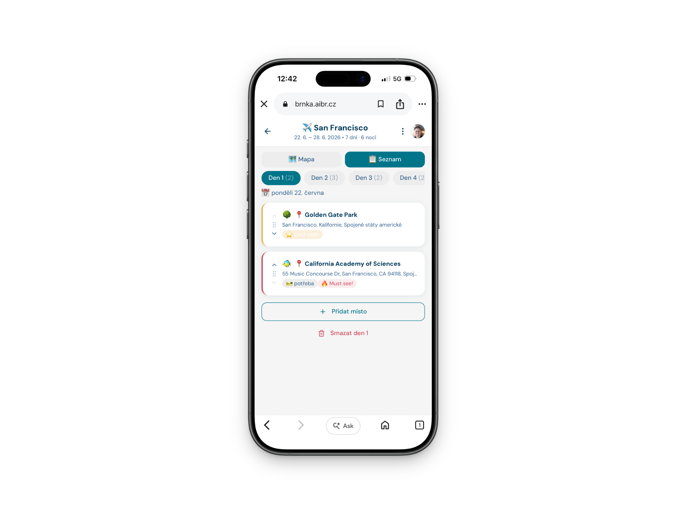
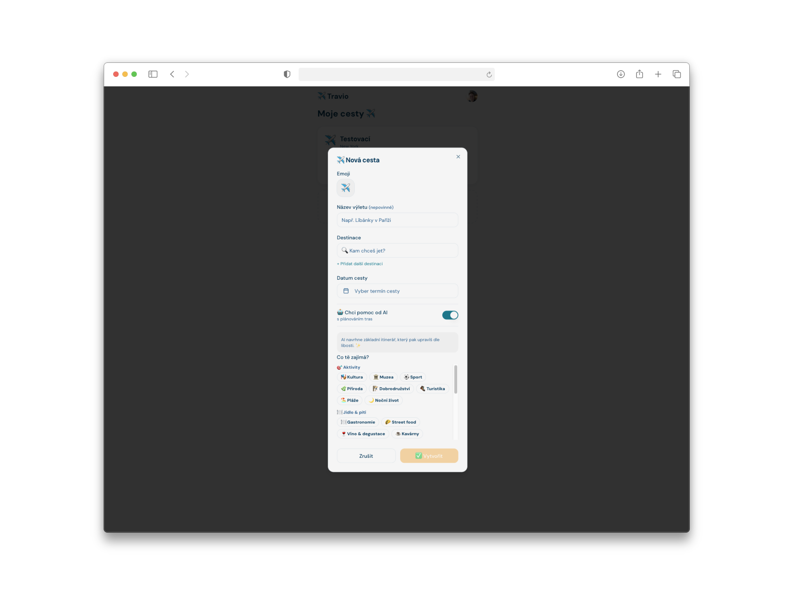
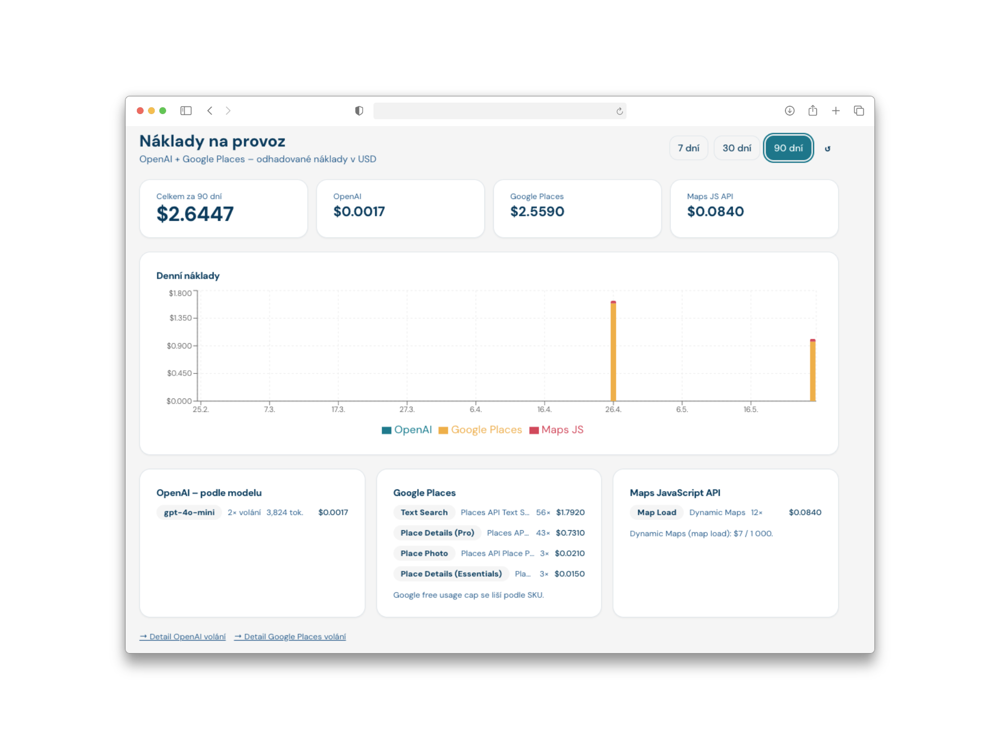

<div align="center">

# ✈️ Travio

**Plánovač cestovních itinerářů pro mobil, s pomocí AI**

Naplánuj cestu den po dni, nech AI navrhnout kostru itineráře a sdílej ji jedním odkazem.

[](https://github.com/matej-brnka/travio-app/releases)
[](https://matej-brnka.github.io/travio-app/)


[**🌐 Živá aplikace**](https://brnka.aibr.cz) · [**🎞️ Prezentace projektu**](https://matej-brnka.github.io/travio-app/) · [**📦 Releases**](https://github.com/matej-brnka/travio-app/releases)



</div>

---

## Obsah

- [O projektu](#o-projektu)
- [Funkce](#funkce)
- [Tech stack](#tech-stack)
- [Architektura](#architektura)
- [Rychlý start](#rychlý-start)
- [Konfigurace](#konfigurace)
- [Databáze](#databáze)
- [Nasazení (Docker)](#nasazení-docker)
- [Testy](#testy)
- [Prezentace](#prezentace)
- [Struktura repozitáře](#struktura-repozitáře)
- [Roadmapa](#roadmapa)
- [Autor](#autor)

## O projektu

Travio je webová aplikace navržená primárně pro mobil, ve které si cestovatel přehledně naplánuje místa v destinaci a nemusí přitom žonglovat se zápisníky a tabulkami.

1. Zadáš destinaci a termín. Aplikace vytvoří strukturu dnů.
2. Volitelně necháš **AI sestavit kostru itineráře** (GPT‑4o‑mini a Google Places).
3. Místa přidáváš, řadíš drag & dropem a označuješ jako navštívená.
4. Cestu sdílíš **anonymním read‑only odkazem**, podobně jako v Google Drive.

> Registrace funguje pouze na pozvánku (invite‑only), přihlášení probíhá přes Google.

## Funkce

| | |
|---|---|
| 🗓️ **Cesty a dny** | Termín `dateFrom`–`dateTo`, automatický výpočet dní, sekce „Volné“ pro nepřiřazená místa |
| 🤖 **AI itinerář** | GPT‑4o‑mini navrhne místa (dayIndex, priorita, potřeba vstupenky), Google Places je doplní o souřadnice, adresu, web a otevírací dobu |
| 🗺️ **Mapa jako hlavní UI** | Google Maps přes celou obrazovku, kliknutím na nativní POI přidáš místo přímo do vybraného dne |
| ↕️ **Drag & drop** | Přesouvání a řazení míst mezi dny |
| 🔁 **Detekce duplicit** | Podle `googlePlaceId` (záloha `name + address`), před přidáním se aplikace zeptá |
| 🌦️ **Počasí** | Předpověď z yr.no (do 9 dní), u vzdálenějších termínů historická data z Open‑Meteo |
| 🔗 **Sdílení** | Read‑only odkaz `/share/:token` bez přihlášení |
| 🔐 **Auth a role** | Supabase Auth (Google OAuth, JWT ES256 přes JWKS), invite‑only allowlist, role `admin` / `user` |
| 💰 **Admin dashboardy** | Log volání OpenAI (prompty, tokeny, cena), náklady Google Places podle SKU, správa pozvánek, vše s e‑mailem uživatele pro audit |

<details>
<summary>📸 Další screenshoty</summary>
<br />
<p align="center">
  
  
  
</p>
</details>

## Tech stack

| Vrstva | Technologie |
|---|---|
| Frontend | React 18, Vite, TypeScript, Tailwind CSS, shadcn/ui, framer-motion, `@vis.gl/react-google-maps` |
| Backend | NestJS 11, TypeScript, `pg` (přímé PostgreSQL připojení) |
| Databáze | Supabase (PostgreSQL, connection pooler, RLS) |
| Auth | Supabase Auth: Google OAuth, JWT (ES256, JWKS) |
| Externí API | OpenAI, Google Places API, Google Maps JS API, yr.no, Open‑Meteo |
| Deployment | Docker Compose, Traefik v3 (HTTPS, Let's Encrypt), nginx |

## Architektura

```
            ┌──────────────── Traefik (80/443, Let's Encrypt) ────────────────┐
            │                                                                 │
   brnka.aibr.cz/*                                               brnka.aibr.cz/api/*
            │                                                                 │
   ┌────────▼────────┐        REST /api         ┌─────────────────────────────▼──┐
   │ Frontend (SPA)  │ ───────────────────────▶ │ Backend (NestJS)               │
   │ React + nginx   │                          │ trips · days · places · auth   │
   └────────┬────────┘                          │ external: AI, Places, počasí   │
            │ Google OAuth                      └───┬──────────┬──────────┬──────┘
            ▼                                       │          │          │
   ┌─────────────────┐       PostgreSQL (pg)        │          │          │
   │  Supabase Auth  │◀─────────────────────────────┘          │          │
   │  + PostgreSQL   │                                 OpenAI  │  Google Places
   └─────────────────┘                                         │  yr.no / Open‑Meteo
```

**AI workflow:** uživatel zaškrtne „Pomoc od AI“ → frontend pošle destinaci, termín a zájmy → `AiService.generateItinerary()` → GPT‑4o‑mini vrátí JSON (název, dayIndex, priorita) → Google Places doplní detaily → `PlacesService` uloží výsledek do DB → hotová kostra se zobrazí na mapě.

## Rychlý start

**Předpoklady:** Node.js 20+, npm, projekt v [Supabase](https://supabase.com) a API klíče (Google Maps/Places, OpenAI).

```bash
git clone https://github.com/matej-brnka/travio-app.git
cd travio-app
```

**Backend** (http://localhost:3123)

```bash
cd backend
npm install
cp .env.example .env   # vyplň hodnoty
npm run start:dev
```

**Frontend** (http://localhost:8080 nebo :5173)

```bash
cd frontend
npm install
cp .env.example .env   # vyplň hodnoty
npm run dev
```

## Konfigurace

Každá část má vlastní `.env.example`: kořen (Docker Compose), `frontend/` a `backend/`.

<details>
<summary><code>backend/.env</code></summary>

```env
PORT=3123
FRONTEND_URL=http://localhost:8080
SUPABASE_URL=aws-1-eu-west-1.pooler.supabase.com
SUPABASE_PORT=6543
SUPABASE_DATABASE=postgres
SUPABASE_USER=postgres.your-project-ref
SUPABASE_SERVICE_ROLE_KEY=...
SUPABASE_PROJECT_URL=https://your-project-ref.supabase.co
GOOGLE_PLACES_API_KEY=...
YR_NO_USER_AGENT=travio/1.0 your@email.com
OPENAI_API_KEY=...
OPENAI_MODEL=gpt-4o-mini
```
</details>

<details>
<summary><code>frontend/.env</code></summary>

```env
VITE_API_URL=http://localhost:3123/api
VITE_SUPABASE_URL=https://your-project-ref.supabase.co
VITE_SUPABASE_ANON_KEY=...
VITE_GOOGLE_MAPS_KEY=...
```
</details>

> ⚠️ `.env` soubory nikdy necommituj. Supabase `service_role` klíč patří pouze do backendu, frontend používá jen `anon` klíč.

## Databáze

SQL migrace jsou v [`backend/supabase/migrations/`](backend/supabase/migrations). Spusť je postupně (`001` → `012`) v Supabase SQL Editoru nebo přes `pg` skript.

Pro invite‑only registrace aktivuj v Supabase Dashboardu hook **Auth → Hooks → Before User Created** s funkcí `public.hook_check_invite_allowlist`. Nového uživatele pozveš vložením e‑mailu do `public.auth_signup_invites` nebo přes admin stránku `/app/service/invites`.

## Nasazení (Docker)

```bash
cp .env.example .env
docker compose build
docker compose up -d
```

Traefik vystavuje porty `80` a `443`, HTTP přesměrovává na HTTPS a pro produkční host vydává certifikát přes Let's Encrypt. Frontend běží na `/`, backend na `/api`.

## Testy

```bash
cd frontend && npm run test   # Vitest
cd backend  && npm run test   # Jest
```

## Prezentace

Prezentace projektu (reveal.js) je publikovaná na **[matej-brnka.github.io/travio-app](https://matej-brnka.github.io/travio-app/)**.

Zdroj je v [`docs/presentation/`](docs/presentation): jednotlivé slidy v `slides/*.html` skládá `node build.mjs` do jednoho souboru `prezentace.html`. Workflow [`.github/workflows/pages.yml`](.github/workflows/pages.yml) ji při každé změně v `docs/presentation/**` sestaví a nasadí na GitHub Pages.

Lokální náhled:

```bash
cd docs/presentation
npx serve .        # pak otevři /index.html (načítá slidy ze slides/)
```

## Struktura repozitáře

```
.
├── backend/            # NestJS REST API (trips, days, places, auth, external)
│   └── supabase/migrations/
├── frontend/           # React + Vite SPA
├── docs/               # dokumentace, wireframy, prezentace
│   └── presentation/   # reveal.js prezentace (→ GitHub Pages)
├── docker-compose.yml  # Traefik + frontend + backend
├── AGENTS.md           # instrukce pro AI agenty
└── chunks.MD           # implementační plán
```

## Roadmapa

- [ ] 🌐 Veřejné sdílení itinerářů komunitou
- [ ] 📶 Offline režim (Service Worker a lokální cache)
- [ ] 💬 Chatbot pro přidávání míst
- [ ] 💳 Kreditový model pro AI funkce
- [ ] 👥 Kolaborativní plánování v reálném čase
- [ ] 🌍 Cesty s více destinacemi (datový model je připravený)

## Autor

**Matěj Brnka**: [@matej-brnka](https://github.com/matej-brnka)
